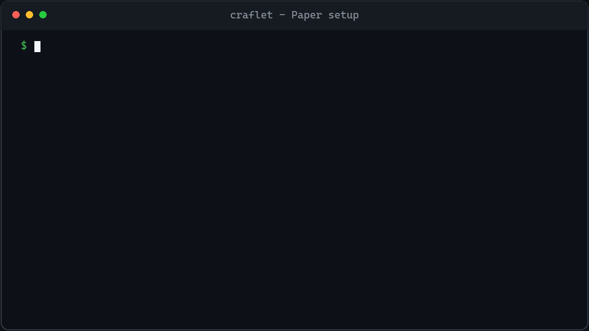

# Craflet

Manage Paper and Velocity server JARs, plugins, configuration, and backups. Keep your intended setup in Git, capture changes made by the server, and apply updates during a managed start or restart.

Craflet runs on the server host and targets Linux, Windows, and macOS. For remote servers, install it on that host and connect with your usual SSH client.

## See setup, console control, and plugin updates in action



The demo follows a first install, runs `list` through the interactive console, detaches while Paper keeps running, then stages and applies a LuckPerms update during restart.

## Installation

You need **Node.js 24.20.0 or later** and the Java version required by your server. Make Java available on `PATH`, or set an absolute `java.command` in `craflet.yaml`. Craflet does not install Java, establish SSH connections, or register OS services.

> The first npm release is pending; the npm/npx commands below will be available after publication.

Install the CLI globally:

```sh
npm install --global craflet
craflet --help
```

Or use `npx craflet --help` without a global installation. The examples below use `craflet`; you can use `npx craflet` instead.

## Set up your first server

Create a Paper project, resolve its server JAR, add a plugin, and start the managed server:

```sh
craflet init my-server --name survival --type paper --version 26.2 --yes
cd my-server
craflet install
craflet add modrinth:luckperms
craflet list
craflet doctor
craflet start
craflet status
```

`init` creates the project without starting Java. `install` resolves the declared server build into `craflet-lock.yaml` and the shared cache. `add` downloads the plugin, reads its identity from the JAR descriptor, records the source, and prepares a pending installation. `start` copies the complete pending installation into the runtime before it launches Java. Commands print concise, human-readable summaries by default; add `--json` when a script needs structured output.

Paper requires acceptance of the [Minecraft EULA](https://www.minecraft.net/eula); after reading it, pass `--yes` to `init`, `start`, `run`, or `restart` to record consent. In a plain interactive terminal outside CI, omit `--yes` and avoid `--json` and `--dry-run` to see the proposed `eula.txt` and agreement link, then choose Agree or Decline; CI, non-interactive, and JSON runs require `--yes`, while `--dry-run` never records consent. Consent is remembered for the current OS user and Craflet home; Velocity does not use this flow.

A pristine standalone server does not need a backup repository for its first start. Applying pending changes to an existing installation or runtime data requires a configured, usable [backup repository](#backups).

Already have a server? Stop it first. `craflet import --help` explains how to copy it into a new project while leaving the original files unchanged.

## Update a plugin safely

After [setting up backups](#backups), check for a new plugin release and prepare it while the current JAR keeps running:

```sh
craflet outdated LuckPerms
craflet update LuckPerms
craflet list
craflet deploy plan
craflet restart
craflet list
```

`outdated` only checks upstream releases. `update` changes the declaration and lock, downloads and verifies the new JAR, and records it as pending. It does not replace the JAR under `runtime/plugins` or change the version currently loaded by the server. `list` shows the requested source alongside locked, pending, and active versions so you can review the transition.

On `restart`, Craflet verifies prerequisites, gracefully stops the server, takes a cold backup, applies the pending installation, and starts the new active version. Use `update --all` to update plugins and the server build together, or `restart --active` to restart without applying pending changes.

### Everyday commands

| Command | Purpose |
| --- | --- |
| `craflet status` | Check the managed process. |
| `craflet logs --follow` | Follow its logs. |
| `craflet console` | Open an interactive console. |
| `craflet stop` | Request shutdown and verify that Java exits. |
| `craflet restart` | Restart, applying prepared changes when present. |
| `craflet run` | Start and stay attached to the logs. |

Ctrl-C in `run` requests a graceful shutdown. Disconnecting `console` or interrupting `logs --follow` does not stop the server. Timeouts do not automatically force termination; an unidentifiable process is reported as `unknown`.

## Project files

| Path | What it contains |
| --- | --- |
| `craflet.yaml` | Server, plugin, Java, secret-reference, and backup settings. |
| `craflet-lock.yaml` | Resolved versions, sources, sizes, and SHA-256 hashes. |
| `config/` | Base configuration to review and keep in Git. |
| `runtime/` | Working server files, worlds, and plugin data. |
| `.craflet/` | Local installation state, pending changes, and recovery journals. |

Keep the declarations, lock, and reviewed base configuration in Git. Keep runtime data, local state, and actual secrets out of Git. Craflet does not automatically commit or push.

## Choose plugin sources

`add` reads the plugin's name from `plugin.yml` or `paper-plugin.yml`, or its ID from `velocity-plugin.json`. It does not execute the JAR. Use `craflet inspect ../build/MyPlugin.jar` to inspect a local JAR first; `craflet list` shows the names to use in later commands.

Supported source forms:

```text
modrinth:<project>@<version>
spigotmc:<resource-id>@<version>
hangar:<project>@<version>
github:<owner>/<repo>@<tag>#<asset-name>
file:../build/MyPlugin.jar
file:../build/MyPlugin-*.jar
```

Omit `@<version>` for a provider when you want its latest eligible release, as in `modrinth:luckperms`. The lock always records the exact resolved source and hash. Plugin version labels are treated as opaque provider values rather than assumed to be SemVer.

A local glob must match exactly one file. Relative paths are based on the directory containing `craflet.yaml`. Structured YAML such as `{ provider: file, path: ../build/MyPlugin.jar }` is also supported. If a provider requires unsupported authentication, an external download, or restricted distribution, Craflet explains the limitation and directs you to `file:`.

`install` reproduces existing lock entries; `install --frozen-lockfile` refuses missing or outdated entries. `update` selects new versions and also imports changed local JARs. Use `update --server` for server builds or `update --all` for plugins and the server. Routine updates do not change the declared Minecraft version. A plugin identity change is rejected rather than silently renamed.

### Pending and active installations

**Active** is the deployed installation. **Pending** is the prepared set of JARs and configuration for a later deployment. `add`, `remove`, `install`, and `update` prepare pending changes without replacing running JARs.

`start`, `run`, and `restart` apply pending changes by copying files after confirming shutdown, rechecking configuration, and taking the required backup. `--active` uses the current active installation without applying pending changes. `deploy apply` requires a stopped server and leaves it stopped; `deploy discard` discards pending changes. Removing a plugin does not delete its stored data.

## Configuration and secrets

`config/` mirrors paths under `runtime/`; per-file mappings in `craflet.yaml` are unnecessary:

```text
config/server.properties             -> runtime/server.properties
config/config/paper-global.yml       -> runtime/config/paper-global.yml
config/plugins/MyPlugin/config.yml   -> runtime/plugins/MyPlugin/config.yml
```

**Register secrets before capturing files that contain them.** Paper can generate `management-server-secret` in `runtime/server.properties` even when its management server is disabled. Before the initial capture, securely copy that exact value into a private file outside Git and register its path, for example:

```yaml
secrets:
    PAPER_MANAGEMENT_SECRET:
        file: /private/paper-management-secret
```

Use a private path appropriate for your host; the file should contain only the secret value. An `env: ENVIRONMENT_VARIABLE_NAME` reference is also supported, provided the variable is available whenever Craflet needs it. **Craflet does not automatically load `.env` files.**

Captured values become `${secret:NAME}` references. Pending state, diffs, and observation baselines also use references. Known server secret fields with unregistered plaintext values are rejected, but Craflet cannot discover every plugin's secret fields. Review files before committing. The runtime and restored data can contain real secrets and must remain protected.

After registering the necessary secrets, capture configuration deliberately:

```sh
craflet config list --candidates
craflet config capture --initial
craflet config track plugins/MyPlugin/config.yml
craflet config diff
craflet config capture
craflet install
```

Initial capture considers existing standard server files, operator lists, and whitelists. Ban lists require `--include-bans`. Arbitrary plugin YAML is not automatically tracked; configuration commands operate on one project at a time.

Capture compares the base configuration, its previous observation, and the current runtime. Conflicting files are left unchanged. Review a conflict before choosing `config resolve <path> --use base` or `--use runtime`. After editing or capturing the base, run `install` to prepare it for deployment. If runtime files change after preparation, applying the pending installation is refused until you review and prepare again.

Unchanged files retain their original text. Managed configuration is not run through a source formatter. Comments in modified TOML files are not currently preserved.

## Backups

Backups use encrypted restic repositories in an explicitly registered local directory or mounted NAS location. Choose an absolute destination outside the runtime and staging directories, with an existing parent. For a new repository, the destination must be empty or absent.

Set `CRAFLET_BACKUP_PASSWORD` securely in your environment before these commands, or use `--password-file` with a private file. Only the reference is saved, so it must remain available in later sessions. Replace the example paths with paths on your host, such as `C:\Backups\survival` on Windows.

```sh
craflet backup setup main --path /mnt/backups/survival --password-env CRAFLET_BACKUP_PASSWORD --init
craflet backup plan
craflet backup create
craflet backup list
craflet backup check --read-data
```

Omit `--init` when registering an existing repository. Craflet checks the registered path and repository ID; a missing destination does not silently redirect backups or initialize an empty NAS mount point. It prepares and verifies restic before stopping the server.

A cold backup stops the server, saves the selected data, then resumes only servers that were previously running, using the same active installation. It never applies pending updates. Use `backup create --leave-stopped` to keep the server stopped. Failed checks before shutdown leave it running; a failed backup after shutdown leaves it stopped.

Edit the generated `backup.files` list to select data. Patterns are relative to `craflet.yaml`: normal patterns include, `!` patterns exclude, and the last match wins. Use a later normal pattern to re-include files; `!!` and `.gitignore` are not used. Defaults include runtime and shared data while excluding all JARs, including custom JARs, plus logs and downloaded caches. Symlinks are not followed; external data needs explicit inclusion.

SQLite can be declared under `backup.databases` with `id`, `kind: sqlite`, and `path`. MySQL and MariaDB also need connection settings, a password reference, and matching dump/client commands. They support InnoDB tables only and require `sslCa` for connections outside loopback. You must stop any database writers that Craflet does not manage.

### Restore safely

First extract a snapshot into a separate empty directory. Inspect it before applying it to the server:

```sh
craflet backup restore <snapshot-id> --to /restore/survival
craflet backup apply /restore/survival --dry-run
craflet backup apply /restore/survival
```

`apply` verifies the files and targets, stops the server, and takes a backup before replacing data. It restores the snapshot's active installation, leaves the server stopped, and clears pending. Current YAML declarations and the shared lock remain unchanged, so the requested and restored active versions may differ. Inspect the result and use `craflet start --active` to launch the restored installation. Additional data roots require `--map root-id=absolute-path`; database restores require `--database id`.

JARs are recovered from the cache or source with the exact hash recorded for the snapshot. **Keep older custom JARs retrievable.** If an old cached JAR was deleted and its `file:` source was replaced, restoration is rejected before shutdown rather than substituting newer bytes.

`backup prune` and `cache prune` preview deletions by default; deletion requires `--apply`. Cache pruning protects registered locks, active and pending installations, and operations in progress. The shared JAR cache lives under `~/.craflet/cache/artifacts/sha256/`; set `CRAFLET_HOME` to use another home directory.

## Multiple servers

Group independent projects in `craflet-workspace.yaml`:

```yaml
schemaVersion: 1
projects:
    - servers/*
```

Each server has its own `craflet.yaml` and versions, with one shared workspace lock. Use `workspace list`, `-r` to select all projects, or `--filter <name-or-path-pattern>` to select a subset. An empty selection is an error.

```sh
craflet workspace list
craflet -r status
craflet --filter survival outdated
```

If servers share a database, assign the same `backup.group` to every writer in the workspace. Matching database, repository, and retention settings are required. The group stops all members before taking one snapshot; shared data and databases are restored only once.

Select every group member for `start`, `restart`, `deploy apply`, `backup create`, and `backup apply`, and configure the group's backup repository before its first start. `install` and `update` may prepare only a subset. Restoring into a separate directory does not alter the live servers. Partial runtime failures are reported per server rather than hidden.

## Troubleshooting and recovery

`validate` checks declarations and managed metadata. `doctor` diagnoses Java, configuration, runtime state, and backup prerequisites without starting the server or changing files. It cannot fully validate every plugin's configuration.

If deployment or restoration is interrupted:

```sh
craflet doctor
craflet recover --dry-run
craflet recover
```

Inspect the proposed recovery before applying it. `recover --unlock` removes only locks belonging to operations that have ended; it does not kill Java based solely on a PID. If an SQL restore fails partway through, Craflet refuses automatic replay, records the earlier snapshot as `backupId` in the operation journal, and requires manual database recovery.

Use `--json` for structured automation output, `--dry-run` to preview changes, and `--offline` for artifact retrieval without network access. `--yes` confirms an explicitly requested operation but never bypasses safety checks. Run `craflet --help` or a command's `--help` for its complete options.

## Agent skill

This repository includes a distributable Craflet agent skill at `skills/craflet`. It teaches compatible AI tools the project model, CLI workflows, update boundaries, backup rules, and recovery invariants.

Preview it with `gh skill`:

```sh
gh skill preview sya-ri/craflet skills/craflet
```

Or install only this skill with `npx skills`:

```sh
npx skills add sya-ri/craflet --skill craflet
```

Restart the agent tool after installation so it reloads available skills.

For contribution instructions, see [CONTRIBUTING.md](https://github.com/sya-ri/craflet/blob/master/CONTRIBUTING.md).
